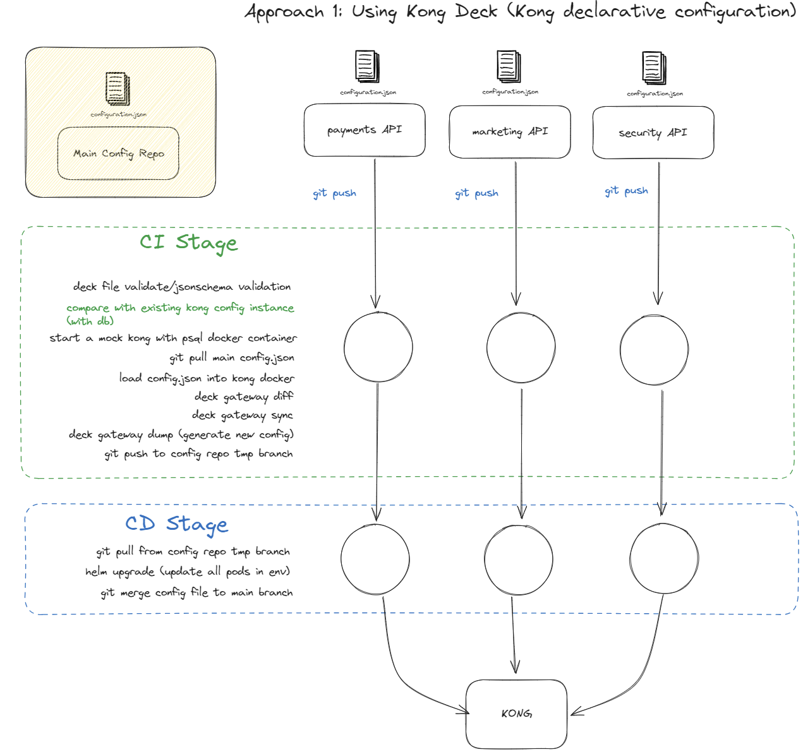

# Managing declarative configuration

## Why manage declaration file

In the case of many services, managing everything in 1 file is unreliable and unsafe, multiple writes could occur at once time and could cause the file to be corrupted.

## Constraints

- Concurrency Control:
  - Ensure that write operations to the Kong configuration file are atomic, preventing partial updates that could lead to an inconsistent state.
  - Implement locking mechanisms to handle concurrent writes and reads, ensuring that only one process can perform write operations at a time, while still allowing multiple concurrent reads.
- Data Integrity:
  - Validation: Configuration file should be valid when loaded into kong
- Fault Tolerance:
  - File should be regularly backed up, or versioned, so rollback or restore from backup is possible.

## Method 1: Kong deck (ApiOps tool) to compare file to test kong container, then dump config file, and upload to kong pods



- Use `kong deck` as to help manage configuration. [Click here to find out more about deck.](https://docs.konghq.com/deck/latest/)
- It is not fully compatible with kong dbless (not able to sync), but there is a workaround we can do.
- Also provides drift detection, can help sync instance
- Also feature with open api spec to kong specification, able to help with APIOps

- Essential commands:
  - `deck file validate` - validate the deck configuration state file.
  - `deck gateway diff` - check the diff with existing kong instance.
  - `deck gateway sync` - sync the diff with existing kong instance.
  - `deck gateway dump` - dump existing kong configuration to file. (generate new config)

## Method 2: Gitops approach self-written merging approach

Link to medium article: <https://surenraju.medium.com/gitop-approch-to-configuration-management-in-kong-dbless-mode-bf0f9fc0a68e>

- Provide some sort of json schema to validate the configuration (validate at both merged, and individual configuration files)

- For synchronization, use a sidecar container or cron job every x seconds to send http request to `/GET config`, if different from our main config (which can be pulled from Git repo), we can generate an alert whilst `/POST config` to sync.

- Split declaration into multiple files
- `global` file, globally declared plugins:

```yaml
plugins:
 - name: jwt
   config:
     header_names: "my-header"
```

- `service` file, per-service API route configuration defined in a seperate yaml file.

```yaml
- name: my-route
   paths:
   - /my-route
   methods:
   - GET
   plugins:
   - name: cors
     config:
       origins:
       - example.com
```

- `master` file, merged configuration

```yaml
services:
 - name: my-service
   url: https://example.com
   routes:
     - name: my-route
     paths:
     - /my-route
     methods:
     - GET
 plugins:
 - name: jwt
   config:
     header_names: "my-header"
 - name: cors
   config:
     origins:
     - example.com
```

- When file merged, post the new config to upstream kong pods.
